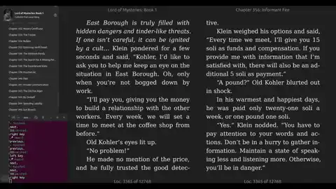

# voice-to-key

Hands-free keyboard control via voice commands — listens to your microphone, transcribes speech locally with [faster-whisper](https://github.com/SYSTRAN/faster-whisper), and simulates key presses when configured phrases are spoken.



## Install

```bash
pip install -e .
# System requirement (Linux, one-time): sudo apt install libportaudio2
```

## Usage

```bash
voice-controller                           # start with default config
voice-controller --list-devices            # list microphones
voice-controller -c my-commands.yaml       # custom config
voice-controller -v                        # verbose output
```

Commands are defined in `config.yaml`:

```yaml
settings:
  model: tiny
  language: en
  confidence_threshold: 0.75
  cooldown_ms: 800

commands:
  - phrases: [next, next page]
    action: { key: right }

  - phrases: [new tab]
    action: { hotkey: [ctrl, t] }
```

## How It Works

```
Microphone → VAD (Silero) → Whisper (faster-whisper) → PhraseMatcher → Keyboard
```

Speech is detected with Silero VAD, transcribed offline by Whisper (`tiny` model, ~75 MB), normalized (lowercase, no punctuation), matched against configured phrases, and the corresponding keyboard action is triggered.

## License

MIT
